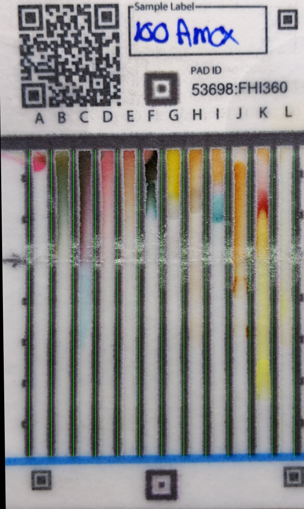

# PAD Salience Annotations

A system for capturing expert annotations on PAD (Paper Analytical Device) card images to build training datasets for AI models.

## What is PAD?

**PAD (Paper Analytical Device)** is a paper-based test card developed by the [Notre Dame PAD Project](https://padproject.nd.edu/) for screening pharmaceutical quality. Each card has 12 lanes (A-L) with different chemical reagents that produce color reactions to identify drugs and detect counterfeits.

<p align="center">
  
  <br>
  <em>Example PAD card showing 12 lanes (A-L) with color reactions for Amoxicillin</em>
</p>

## Purpose

This project builds a structured annotation system where:
- **Specialists** mark salient regions on PAD card images
- **Audio explanations** capture expert reasoning
- **Eye-tracking** captures gaze patterns during annotation
- **Data** is formatted for training multimodal AI models (fine-tuning, distillation, embeddings)

## Features

### Current
- Web-based annotation interface with two layout options
- Rectangle and polygon drawing tools
- Automatic lane detection (A-L)
- Continuous audio recording with timestamps
- **Eye-tracking support** with AprilTag markers for Pupil Labs surface tracking
- YAML configuration file for easy customization
- Export to JSONL format
- 26 drug samples from FHI2020 project

### Planned
- SQLite database for data integrity
- Experiment management system
- Specialist progress tracking
- Audio transcription integration (OpenAI API)
- Export pipeline for HuggingFace/Ollama
- Live gaze overlay from eye-tracker

## Quick Start

```bash
# Clone the repository
git clone https://github.com/psaboia/pad-salience-annotations.git
cd pad-salience-annotations

# Install dependencies (requires uv)
uv sync

# Run the server
./run_prototype.sh

# Open in browser
# http://localhost:8765
```

## Layout Options

Two interface layouts are available:

| Layout | URL | Description |
|--------|-----|-------------|
| With Header | `http://localhost:8765` | Toolbar in header, sidebar for recording/annotations |
| Fullscreen | `http://localhost:8765/prototype/index-fullscreen.html` | All controls in sidebar, maximizes tracked area |

Both layouts include 4 AprilTags (tag36h11 family) positioned around the PAD image for Pupil Labs eye-tracking surface detection.

## Configuration

Settings are stored in `config.yaml`:

```yaml
# AprilTag settings
apriltags:
  size_px: 60          # Tag size in pixels (recommended: 60-80)
  margin_px: 10        # Margin between tags and PAD image
  family: "tag36h11"
  ids: [0, 3, 7, 4]

# Layout settings
layout:
  sidebar_width_px: 240
  background_color: "#1a1a2e"
  sidebar_color: "#16213e"

# PAD image settings
pad_image:
  max_height_vh: 85    # Max height as % of viewport
  border_px: 3
  border_color: "#333333"

# Lane detection
lanes:
  start_percent: 0.082
  end_percent: 0.986
  labels: ["A", "B", "C", "D", "E", "F", "G", "H", "I", "J", "K", "L"]
```

Changes take effect after restarting the server and reloading the page.

## Eye-Tracking Setup

For Pupil Labs integration, see [Eye-Tracking Integration](docs/eye-tracking-integration.md).

**AprilTag size recommendations:**
- Minimum detectable: ~32 pixels (white border to white border)
- Recommended: 60-80 pixels for reliable detection at 50-70cm distance
- Tags at corners should be larger if detection issues occur at angles

Generate a reference image showing the tracked area layout:

```bash
python generate_eyetracking_layout.py --output reference.png
```

## Documentation

| Document | Description |
|----------|-------------|
| [Requirements](docs/requirements.md) | Full system requirements and data architecture |
| [Experiment System](docs/experiment-system.md) | Database schema and experiment workflow design |
| [Prototype Specs](docs/prototype-specifications.md) | Current prototype implementation details |
| [Eye-Tracking Integration](docs/eye-tracking-integration.md) | Pupil Labs setup and AprilTag configuration |
| [Feedback Questionnaire](docs/feedback-questionnaire.md) | Questions for users and specialists |

## Project Structure

```
pad-salience-annotations/
├── prototype/
│   ├── index.html              # Annotation interface (with header)
│   └── index-fullscreen.html   # Fullscreen layout (all controls in sidebar)
├── sample_images/
│   ├── manifest.json           # Image metadata
│   └── *.png                   # PAD card images
├── assets/
│   ├── apriltags/              # AprilTag markers for eye-tracking
│   └── eyetracking_layout.png  # Generated layout reference
├── data/
│   ├── annotations.jsonl       # Saved annotations
│   └── audio/                  # Audio recordings
├── docs/                       # Documentation
├── config.yaml                 # Configuration file
├── server.py                   # FastAPI backend
├── generate_eyetracking_layout.py  # Layout image generator
├── run_prototype.sh            # Server launcher
└── pyproject.toml              # Python dependencies
```

## API Endpoints

| Endpoint | Method | Description |
|----------|--------|-------------|
| `/` | GET | Serve annotation interface |
| `/api/config` | GET | Get configuration from config.yaml |
| `/api/save-annotation` | POST | Save annotation session |
| `/api/stats` | GET | Get annotation statistics |

## Data Format

Annotations are saved in JSONL format with normalized coordinates (0-999) compatible with DeepSeek-OCR style grounding:

```json
{
  "session_id": "session_123",
  "sample": {"drug_name": "amoxicillin", "card_id": 15214},
  "annotations": [
    {
      "type": "rectangle",
      "lanes": ["D", "E"],
      "timestamp_start_ms": 12500,
      "timestamp_end_ms": 15800,
      "bbox_normalized": {"x1": 225, "y1": 298, "x2": 335, "y2": 411}
    }
  ],
  "audio": {"filename": "session_123.webm", "duration_ms": 45000}
}
```

## Dependencies

- Python 3.12+
- [uv](https://github.com/astral-sh/uv) - Package manager
- [pad-analytics](https://github.com/PaperAnalyticalDeviceND/pad-analytics) - PAD database API
- [Pillow](https://pillow.readthedocs.io/) - Image processing (for layout generator)
- [PyYAML](https://pyyaml.org/) - Configuration file parsing

## Contributing

We welcome feedback! Please:
- Open an [issue](https://github.com/psaboia/pad-salience-annotations/issues) for bugs or suggestions
- Review the [feedback questionnaire](docs/feedback-questionnaire.md) and share your thoughts

## License

TBD

## Acknowledgments

- [Notre Dame PAD Project](https://padproject.nd.edu/) for PAD technology and data
- [pad-analytics](https://github.com/PaperAnalyticalDeviceND/pad-analytics) package for API access
- [Pupil Labs](https://pupil-labs.com/) for eye-tracking technology
